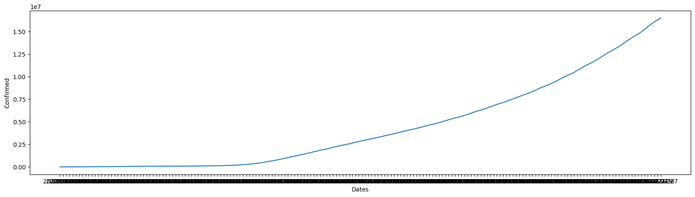
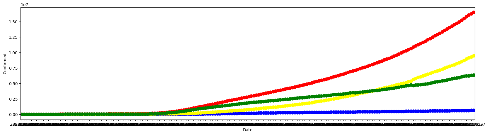
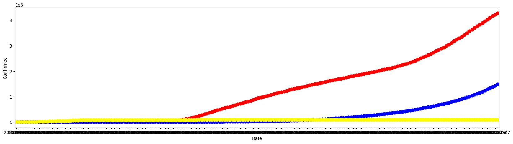
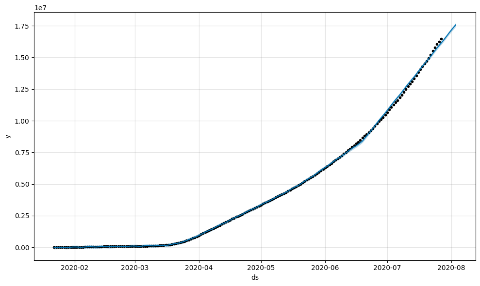

# COVID-19 Global Data Analysis

## Overview
Analysis of the global COVID-19 pandemic (Jan–Jul 2020) using the JHU Clean Complete dataset, covering confirmed cases, deaths, recoveries, and active cases across 180+ countries.

## Tools Used
- Python
- Pandas, NumPy (data cleaning & manipulation)
- Matplotlib, Seaborn (visualization)
- Plotly (interactive world map)
- Facebook Prophet (time series forecasting)

## What I Did
- Cleaned and standardized the dataset (renamed columns, handled data types)
- Analyzed global trends in confirmed cases, deaths, recoveries, and active cases over time
- Compared the three most affected countries: US, China, and India
- Built time series forecasting models using Facebook Prophet to predict future case trends
- Created an interactive choropleth world map showing active cases by country

## Key Insights
- As of the latest date in the dataset (27 Jul 2020), the US recorded ~4.29M confirmed cases with ~2.82M active cases — the highest globally
- India crossed 1.48M confirmed cases, with a recovery count of ~951K, showing a strong recovery rate
- China, where the outbreak started, had largely stabilized by mid-2020, with only ~3,258 active cases remaining out of ~86,783 total confirmed
- Global recovery trends showed steady improvement over the analyzed period

### Sample Visualizations

**Global Confirmed Cases Trend:**

**Overall Trend Comparison (Confirmed, Deaths, Recovered, Active):**

**US vs India — Confirmed Cases Comparison:**

**Time-Series Forecast (Facebook Prophet):**

## How to Run
1. Clone this repository
2. Install required libraries: `pip install pandas numpy seaborn matplotlib plotly prophet`
3. Open and run `covid19_analysis.ipynb` in Jupyter Notebook or Google Colab

## Note
This project was built as a self-practice exercise to strengthen skills in data analysis, visualization, and time series forecasting.
